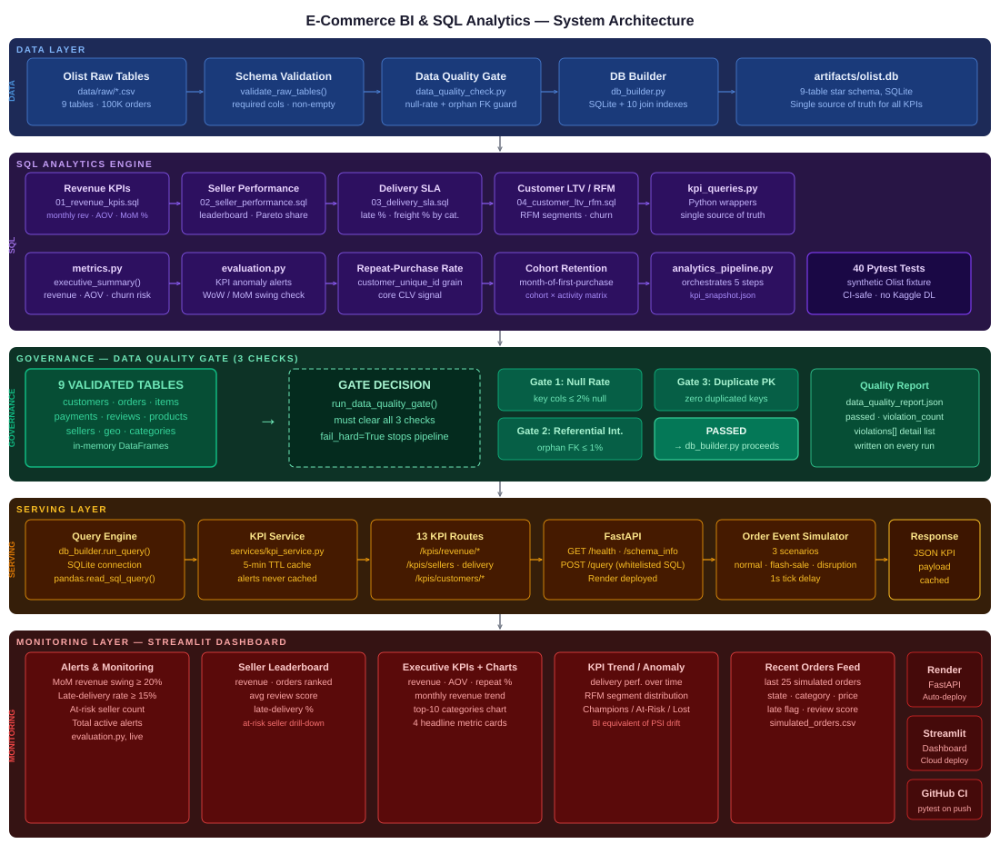
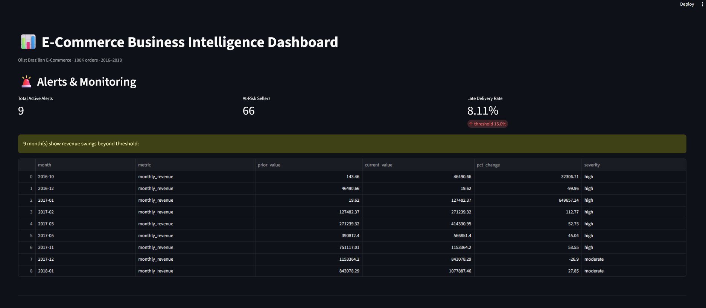
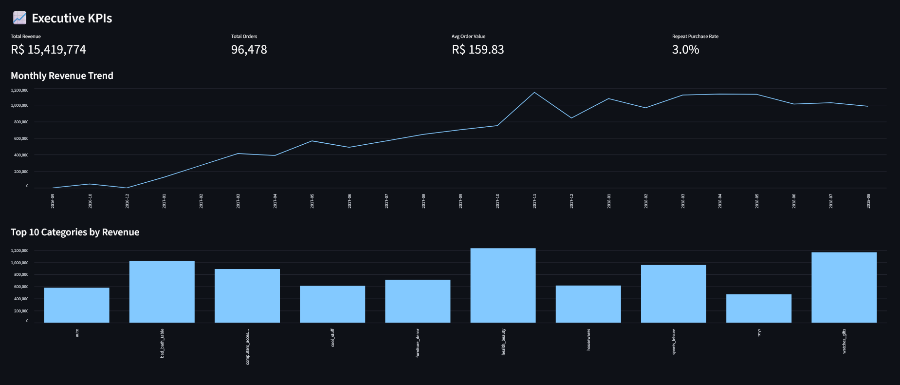
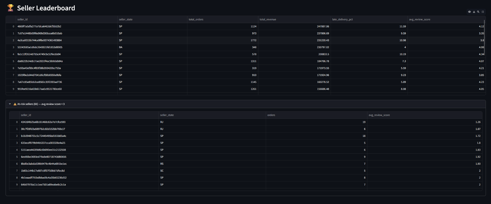
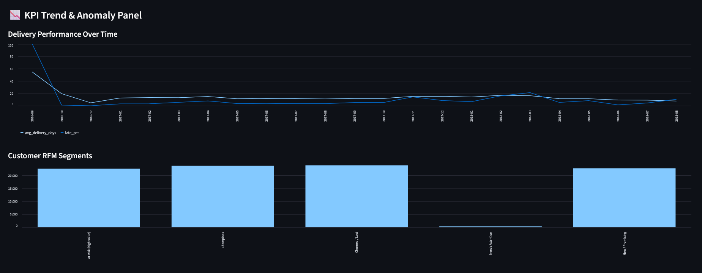
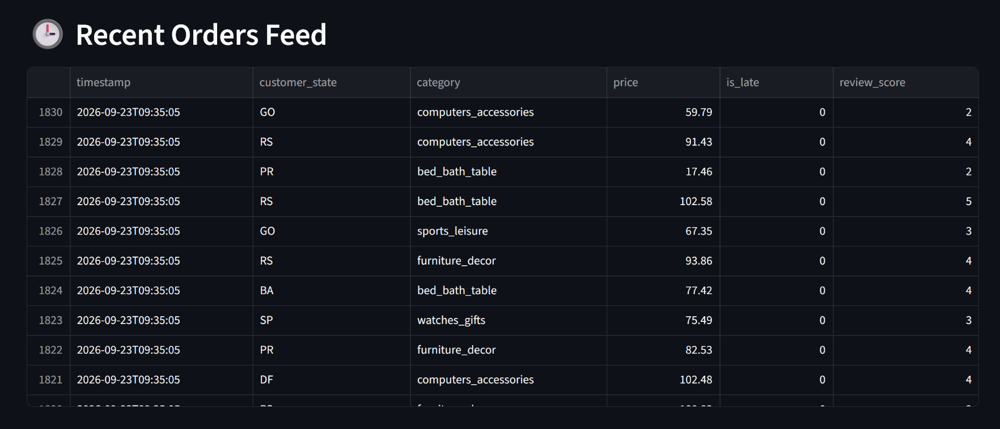
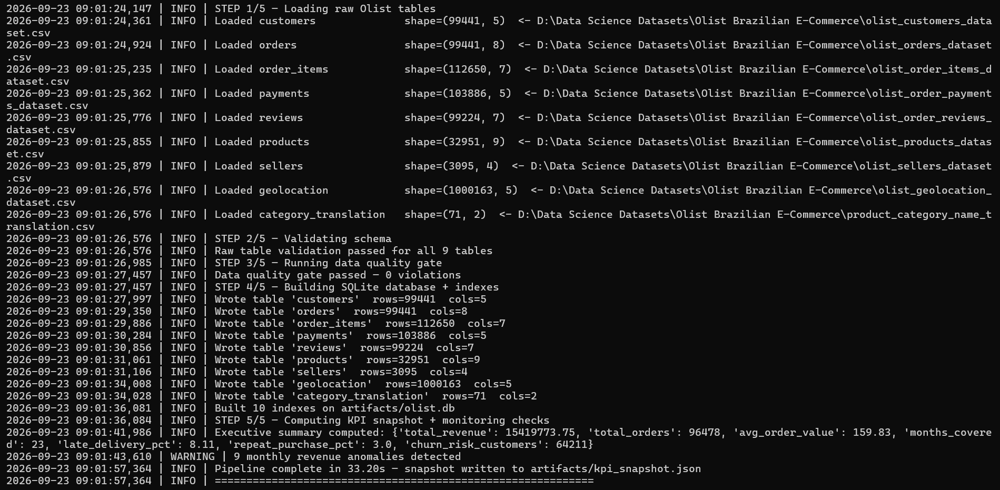
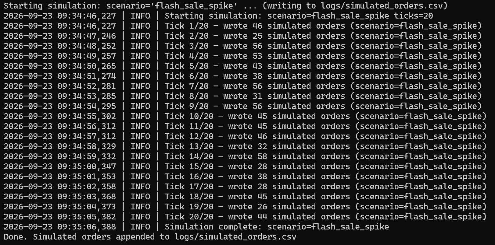
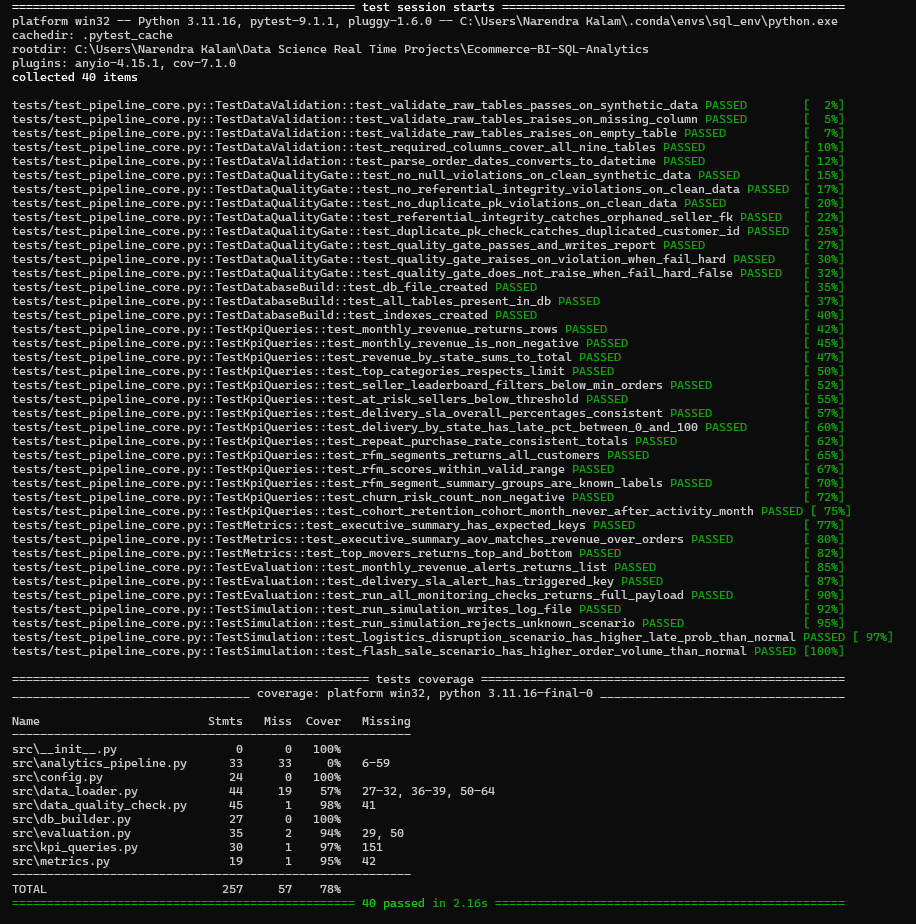
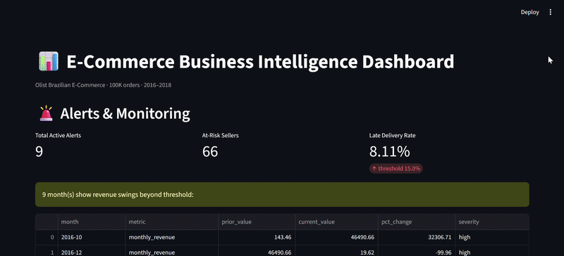

# 🛒 E-Commerce Business Intelligence & SQL Analytics

[](https://github.com/narendrakalam2001/Ecommerce-BI-SQL-Analytics/actions)
[](https://python.org)
[](https://www.sqlite.org/)
[](https://fastapi.tiangolo.com)
[](https://streamlit.io)
[](tests/test_pipeline_core.py)
[](https://docker.com)
[](LICENSE)

> **Domain:** Business Intelligence / Data Analytics Engineering
> **Problem:** SQL-driven KPI system — revenue, seller performance, delivery SLA, customer LTV/RFM, churn
> **Dataset:** [Olist Brazilian E-Commerce — 100K orders · 8 relational tables · 2016–2018](https://www.kaggle.com/datasets/olistbr/brazilian-ecommerce)
> **Industry Context:** Flipkart · Amazon India · Meesho — SQL-first BI layers are how growth, ops, and
> finance teams track the business before any ML model ever touches the data; this is also the
> standard first interview round for analyst/DS roles at Indian e-commerce companies

---

## 💡 Why This Project Matters

Every consumer e-commerce company runs a governed SQL analytics layer long before ML enters the
picture — finance wants revenue by state, ops wants delivery SLA breaches, growth wants churn and
CLV signals. This project builds that exact layer end-to-end:

- A **validated 9-table relational schema** loaded into SQLite with join indexes, not a flat CSV dump
- A **3-check data quality gate** (null-rate, referential integrity, duplicate PK) that fails the
  pipeline *before* a single KPI is computed — the BI equivalent of a leakage check
- **20+ hand-written, interview-grade SQL queries** across 4 KPI domains (`sql/*.sql`), wrapped by a
  single Python source of truth (`kpi_queries.py`) shared by the API, dashboard, and pipeline
- **RFM customer segmentation** (Recency/Frequency/Monetary, quartile-scored) into 5 named business
  segments, plus month-of-first-purchase **cohort retention**
- **KPI trend/anomaly monitoring** — week-over-week and month-over-month swing detection, the BI
  equivalent of PSI feature drift, flagging genuine ramp-up/ramp-down periods automatically
- A served **FastAPI** layer (13 KPI routes + a whitelisted ad-hoc `/query` route) and a 5-section
  **Streamlit** monitoring dashboard, backed by a live **order-event simulator** (3 scenarios)

This mirrors the exact SQL-first BI stack used in production at Indian e-commerce companies — and is
why SQL is the first filter in almost every analyst/DS interview loop.

---

## 📊 Real System Run Results

Actual output from `python scripts/run_pipeline.py` against the full 100K-order Olist dataset:

| Metric | Value |
|---|---|
| **Total Revenue (delivered orders)** | `R$ 15,419,773.75` |
| **Total Delivered Orders** | `96,478` |
| **Average Order Value** | `R$ 159.83` |
| **Months Covered** | `23` (Sep 2016 – Oct 2018) |
| **Late Delivery Rate** | `8.11%` |
| **Repeat Purchase Rate** | `3.0%` (well-documented Olist characteristic) |
| **Churn-Risk Customers** (>180 days inactive, single order) | `64,211` |
| **Data Quality Gate** | `0 violations` — all 9 tables, 0 nulls/orphans/dupes over threshold |
| **Monthly Revenue Anomalies Flagged** | `9` (correctly isolates the 2016 ramp-up months) |
| **Pipeline Runtime** | `~33 seconds` (validate → quality gate → build DB → 5 KPI domains) |
| **Test Suite** | `40 / 40 passing` |

---

## 🔗 Live Links

| Service | URL |
|---|---|
| 🚀 **FastAPI (Swagger UI)** | [https://ecommerce-bi-sql-analytics.onrender.com/docs](https://ecommerce-bi-sql-analytics.onrender.com/docs) |
| 📊 **Monitoring Dashboard** | [https://ecommerce-bi-sql-analytics.streamlit.app](https://ecommerce-bi-sql-analytics.streamlit.app) |
| 📓 **EDA Notebook** | [notebooks/ecommerce_bi_eda.ipynb](notebooks/ecommerce_bi_eda.ipynb) |

> ⚠️ Render free tier: first request may take 30–60 seconds (cold start).

---

## 🏗️ System Architecture



```
╔══════════════════════════════════════════════════════════════════════════════════╗
║        E-COMMERCE BI & SQL ANALYTICS — 5-LAYER SYSTEM                            ║
╠══════════════════════════════════════════════════════════════════════════════════╣
║                                                                                  ║
║  ┌─────────────────────────────── DATA LAYER ──────────────────────────────┐     ║
║  │  Olist CSVs → Schema Validation → Data Quality Gate → DB Builder        │     ║
║  │  9 tables · 100K orders · SQLite + 10 join indexes → artifacts/olist.db │     ║
║  └───────────────────────────────────┬─────────────────────────────────────┘     ║
║                                      ▼                                           ║
║  ┌─────────────────────── SQL ANALYTICS ENGINE ────────────────────────────┐     ║
║  │                                                                         │     ║
║  │  ┌──────────────────┐    ┌───────────────┐    ┌──────────────────────┐  │     ║
║  │  │  Revenue KPIs    │    │  Seller Perf. │    │  Delivery SLA        │  │     ║
║  │  │  monthly · MoM % │    │  leaderboard  │    │  late % · freight %  │  │     ║
║  │  │  by state · cat. │    │  Pareto share │    │  by state / month    │  │     ║
║  │  └──────────────────┘    └───────────────┘    └──────────────────────┘  │     ║
║  │                                                                         │     ║
║  │  Customer LTV/RFM · Cohort Retention · Repeat-Purchase Rate             │     ║
║  │  kpi_queries.py = single source of truth for API + Dashboard + Pipeline │     ║
║  └───────────────────────────────────┬─────────────────────────────────────┘     ║
║                                      ▼                                           ║
║  ┌────────────────── GOVERNANCE — DATA QUALITY GATE (3 CHECKS) ────────────┐     ║
║  │                                                                         │     ║
║  │  Gate 1: Null Rate         key cols ≤ 2% null      →  ✅ PASS / ❌ FAIL│     ║
║  │  Gate 2: Referential Int.  orphan FK ≤ 1%          →  ✅ PASS / ❌ FAIL│     ║
║  │  Gate 3: Duplicate PK      zero duplicated keys    →  ✅ PASS / ❌ FAIL│     ║
║  │                                                                         │     ║
║  │  ALL gates pass → PASSED (db_builder.py proceeds)                       │     ║
║  │  ANY gate fails → pipeline halts, data_quality_report.json logged       │     ║
║  └───────────────────────────────────┬─────────────────────────────────────┘     ║
║                                      ▼                                           ║
║  ┌──────────────────────────── SERVING LAYER ──────────────────────────────┐     ║
║  │                                                                         │     ║
║  │  Query Engine → KPI Service (cache) → FastAPI → 13 KPI routes           │     ║
║  │                                                                         │     ║
║  │  GET  /kpis/summary          → executive summary                        │     ║
║  │  GET  /kpis/revenue/*        → monthly · by-state · top-categories      │     ║
║  │  GET  /kpis/sellers/*        → leaderboard · at-risk                    │     ║
║  │  GET  /kpis/delivery/*       → SLA · by-state                           │     ║
║  │  GET  /kpis/customers/*      → RFM summary · repeat-rate · cohorts      │     ║
║  │  POST /query                 → whitelisted read-only ad-hoc SQL         │     ║
║  └───────────────────────────────────┬─────────────────────────────────────┘     ║
║                                      ▼                                           ║
║  ┌─────────────────── MONITORING LAYER — STREAMLIT DASHBOARD ──────────────┐     ║
║  │                                                                         │     ║
║  │  Section 1: Alerts & Monitoring → MoM swing · SLA breach · at-risk cnt  │     ║
║  │  Section 2: Seller Leaderboard  → revenue/orders/reviews ranked         │     ║
║  │  Section 3: Executive KPIs      → revenue trend · top categories        │     ║
║  │  Section 4: KPI Trend/Anomaly   → delivery trend · RFM distribution     │     ║
║  │  Section 5: Recent Orders Feed  → live feed from order simulator        │     ║
║  │                                                                         │     ║
║  │  Simulator: 3 scenarios (normal · flash-sale · disruption) → CSV feed   │     ║
║  └─────────────────────────────────────────────────────────────────────────┘     ║
╚══════════════════════════════════════════════════════════════════════════════════╝
```

---

## 📸 Dashboard Screenshots

### 🖥️ Full Dashboard UI

Streamlit BI dashboard — alerts panel, seller leaderboard, executive KPI cards, trend/anomaly charts, and live order feed, all in one view.



---

### 📈 Executive KPIs

Headline metric cards (revenue, AOV, repeat-purchase rate) plus the monthly revenue trend and top-10 category charts.



---

### 🏆 Seller Leaderboard

Sellers ranked by revenue with orders, late-delivery %, and average review score — plus an at-risk seller drill-down.



---

### 📉 KPI Trend & Anomaly Panel

Delivery-performance trend over time and RFM segment distribution — the BI equivalent of a PSI drift panel.



---

### 🕒 Recent Orders Feed

Live feed from the order-event simulator — state, category, price, late flag, and review score for the most recent simulated orders.



---

## 📊 Analytics Reports

| Executive Summary | Simulation Run |
|---|---|
|  |  |

| Test Coverage |
|---|
|  |

---

## 🎬 System Demo



---

## 📁 Project Structure

```
Ecommerce-BI-SQL-Analytics/
│
├── src/                                    # Core analytics engine
│   ├── config.py                           # All constants — paths, thresholds, RFM/churn params
│   ├── data_loader.py                      # Olist loader · schema validation · .csv/.xlsx fallback
│   ├── data_quality_check.py               # Null-rate · referential integrity · duplicate-PK gate
│   ├── db_builder.py                       # SQLite build + 10 join indexes · run_query()
│   ├── kpi_queries.py                      # Python wrappers over sql/*.sql — single source of truth
│   ├── metrics.py                          # executive_summary() · top_movers()
│   ├── evaluation.py                       # KPI anomaly alerts — WoW/MoM swing detection
│   └── analytics_pipeline.py               # End-to-end orchestration → kpi_snapshot.json
│
├── sql/                                    # Reference SQL artifacts — 20+ interview-grade queries
│   ├── 01_revenue_kpis.sql                 # Monthly revenue · AOV · MoM growth · by state/category
│   ├── 02_seller_performance.sql           # Leaderboard · at-risk sellers · Pareto concentration
│   ├── 03_delivery_sla.sql                 # On-time vs late · freight % · speed-bucket vs reviews
│   └── 04_customer_ltv_rfm.sql             # LTV · repeat-rate · RFM segmentation · cohort retention
│
├── serving/
│   └── ecommerce_api.py                    # FastAPI: 13 KPI routes + whitelisted /query
│
├── services/
│   └── kpi_service.py                      # 5-min TTL cache layer between API/dashboard and SQL
│
├── monitoring/
│   └── monitoring_dashboard.py             # Streamlit: 5-section BI dashboard
│
├── simulation/
│   └── order_event_simulator.py            # 3-scenario synthetic order generator
│
├── tests/
│   ├── conftest.py                         # Synthetic Olist-shaped fixtures (CI-safe, no Kaggle DL)
│   └── test_pipeline_core.py               # 40 pytest unit tests — all passing
│
├── scripts/
│   ├── build_database.py                   # python scripts/build_database.py
│   ├── run_pipeline.py                     # python scripts/run_pipeline.py
│   ├── run_api.py                          # python scripts/run_api.py
│   ├── run_dashboard.py                    # python scripts/run_dashboard.py
│   └── run_simulation.py                   # python scripts/run_simulation.py flash_sale_spike
│
├── notebooks/
│   ├── ecommerce_bi_eda.ipynb              # Professional EDA — 25 steps, fully executed
│   └── ecommerce_bi_eda.html               # Rendered HTML export
│
├── data/
│   ├── raw/                                # Full Olist CSVs go here (not committed — see Quickstart)
│   └── sample/                             # Lightweight sample dataset for quick testing
│       ├── olist_customers_dataset.csv
│       ├── olist_orders_dataset.csv
│       ├── olist_order_items_dataset.csv
│       ├── olist_order_payments_dataset.csv
│       ├── olist_order_reviews_dataset.csv
│       ├── olist_products_dataset.csv
│       ├── olist_sellers_dataset.csv
│       ├── product_category_name_translation.csv
│       ├── sample_dataset_info.txt
│       └── sample_table_summary.csv
│
├── artifacts/                              # Generated — olist.db, kpi_snapshot.json, quality report
├── logs/                                   # Generated — simulated_orders.csv
│
├── docs/
│   ├── architecture/
│   │   └── ecommerce_bi_architecture.svg   # 5-layer system architecture diagram
│   ├── screenshots/
│   │   ├── dashboard_full_ui.png
│   │   ├── executive_kpis.png
│   │   ├── seller_leaderboard.png
│   │   ├── kpi_trend_&_anomaly_panel.png
│   │   └── recent_orders_feed.png
│   ├── reports/
│   │   ├── executive_summary.png
│   │   ├── simulation.png
│   │   └── test_coverage.png
│   └── gifs/
│       └── system_demo.gif
│
├── Dockerfile                               # FastAPI production image
├── Dockerfile.dashboard                     # Streamlit dashboard container
├── docker-compose.yml                       # API + Dashboard (ports 8000 + 8501)
├── .github/workflows/ci.yml                # GitHub Actions — pytest on every push
├── .gitignore
├── .dockerignore
├── LICENSE                                  # MIT License
├── README.md                                # This file
├── render.yaml                              # Render.com deployment config
├── requirements.txt                         # All dependencies
├── requirements_api.txt                     # API-only deployment (Render)
└── requirements_dashboard.txt               # Dashboard-only deployment (Streamlit Cloud)
```

---

## 🚀 Quickstart

### 1. Clone & Install

```bash
git clone https://github.com/narendrakalam2001/Ecommerce-BI-SQL-Analytics.git
cd Ecommerce-BI-SQL-Analytics
pip install -r requirements.txt
```

### 2. Get the Dataset

Download [Olist Brazilian E-Commerce](https://www.kaggle.com/datasets/olistbr/brazilian-ecommerce) → place all CSVs in `data/raw/`

```
data/raw/
├── olist_customers_dataset.csv
├── olist_orders_dataset.csv
├── olist_order_items_dataset.csv
├── olist_order_payments_dataset.csv
├── olist_order_reviews_dataset.csv
├── olist_products_dataset.csv
├── olist_sellers_dataset.csv
├── olist_geolocation_dataset.csv
└── product_category_name_translation.csv

A lightweight sample dataset is provided in data/sample/ for quick testing
without the full ~180MB download.
```

### 3. Build the Database

```bash
python scripts/build_database.py
```

Expected output:
```
INFO  Loaded customers              shape=(99441, 5)
INFO  Loaded orders                 shape=(99441, 8)
INFO  Loaded order_items            shape=(112650, 7)
INFO  Raw table validation passed for all 9 tables
INFO  Data quality gate passed — 0 violations
INFO  Built 10 indexes on artifacts/olist.db
Database built successfully at artifacts/olist.db
```

### 4. Run the Full Analytics Pipeline

```bash
python scripts/run_pipeline.py
```

Expected output:
```
STEP 1/5 — Loading raw Olist tables
STEP 2/5 — Validating schema
STEP 3/5 — Running data quality gate
STEP 4/5 — Building SQLite database + indexes
STEP 5/5 — Computing KPI snapshot + monitoring checks
Executive summary computed: {'total_revenue': 15419773.75, 'total_orders': 96478, ...}
Pipeline complete in 33.20s — snapshot written to artifacts/kpi_snapshot.json
```

### 5. Start the API

```bash
python scripts/run_api.py
# API:  http://localhost:8000
# Docs: http://localhost:8000/docs
```

### 6. Start the Dashboard

```bash
python scripts/run_dashboard.py
# Dashboard: http://localhost:8501
```

### 7. Run the Simulator

```bash
python scripts/run_simulation.py normal_day
python scripts/run_simulation.py flash_sale_spike
python scripts/run_simulation.py logistics_disruption
```

### 8. Run Tests

```bash
pytest tests/ -v --cov=src --cov-report=term-missing
# 40 collected · 40 passed
```

---

## 🐳 Docker

```bash
# Start everything
docker compose up --build

# API only
docker compose up api

# Dashboard only
docker compose up dashboard

# Stop
docker compose down
```

| Service | URL |
|---|---|
| FastAPI + Swagger | `http://localhost:8000/docs` |
| Streamlit Dashboard | `http://localhost:8501` |

---

## 🌐 API Reference

### GET /kpis/summary — Executive Summary

```bash
curl "http://localhost:8000/kpis/summary"
```

**Response (real run):**
```json
{
  "total_revenue": 15419773.75,
  "total_orders": 96478,
  "avg_order_value": 159.83,
  "months_covered": 23,
  "late_delivery_pct": 8.11,
  "repeat_purchase_pct": 3.0,
  "churn_risk_customers": 64211
}
```

### GET /kpis/sellers/leaderboard

```bash
curl "http://localhost:8000/kpis/sellers/leaderboard?min_orders=5"
```

### POST /query — Whitelisted Ad-Hoc SQL

```bash
curl -X POST "http://localhost:8000/query?sql=SELECT+COUNT(*)+AS+n+FROM+orders"
```

> Only `SELECT` / `WITH` statements are allowed — any `INSERT`/`UPDATE`/`DELETE`/`DROP`/`ALTER`/`ATTACH`/`PRAGMA` keyword is rejected.

### GET /health

```json
{"status": "running", "database_built": true}
```

### GET /schema_info

Returns row counts for all 9 tables — the BI equivalent of `/model_info`.

### GET /monitoring/alerts

Returns live KPI anomaly alerts, SLA breach status, and at-risk seller count.

Full endpoint list (13 KPI routes) documented interactively at `/docs`.

---

## 📊 SQL KPI Query Bank

| File | KPIs Covered |
|---|---|
| `01_revenue_kpis.sql` | Monthly revenue & AOV · revenue by state · top categories · MoM growth · revenue by payment type |
| `02_seller_performance.sql` | Seller leaderboard · top-20 sellers · at-risk sellers · seller revenue concentration (Pareto) |
| `03_delivery_sla.sql` | On-time vs late rate · delivery time by state · delivery trend · freight-% by category · speed-bucket vs reviews |
| `04_customer_ltv_rfm.sql` | Customer LTV · repeat-purchase rate · RFM segmentation · churn-risk count · cohort retention |

---

## 🛡️ Governance — Data Quality Gate (3 Checks)

Every pipeline run validates all 9 tables against **3 gates** before a single KPI is computed:

| Gate | Condition | Rationale |
|---|---|---|
| Null Rate | Key join columns ≤ 2% null | Prevents silent join failures downstream |
| Referential Integrity | Orphaned foreign keys ≤ 1% | Catches broken relationships between tables |
| Duplicate Primary Key | Zero duplicated primary keys | Prevents double-counted revenue/orders |

> **Why strict gates?** A BI system that silently ships KPIs computed on broken joins or duplicated
> rows can mislead an entire finance or growth team. The gate stops the pipeline the moment data
> quality degrades, rather than letting a bad number reach the dashboard.

**Real run result:**
```
Data quality gate passed — 0 violations
```

Full report logged to `artifacts/data_quality_report.json` on every run.

---

## 📈 Monitoring Dashboard — 5 Sections

| Section | What it shows |
|---|---|
| **1. Alerts & Monitoring** | MoM revenue swing ≥ 20% · late-delivery rate ≥ 15% · at-risk seller count |
| **2. Seller Leaderboard** | Revenue/orders ranked · late-delivery % · avg review score · at-risk drill-down |
| **3. Executive KPIs + Charts** | Revenue · AOV · repeat-rate cards · monthly revenue trend · top-10 categories |
| **4. KPI Trend / Anomaly Panel** | Delivery performance over time · RFM segment distribution |
| **5. Recent Orders Feed** | Live feed from the order-event simulator |

---

## 🧪 Test Coverage

```
40 tests collected across 7 test classes:

  TestDataValidation     (5)  — schema validation · missing columns · empty tables ·
                                 required-columns coverage · datetime parsing
  TestDataQualityGate    (8)  — null-rate check · referential integrity · duplicate PK ·
                                 orphaned seller FK detection · gate pass/fail behaviour ·
                                 report written to disk
  TestDatabaseBuild      (3)  — DB file created · all 9 tables present · join indexes created
  TestKpiQueries        (14)  — monthly revenue · revenue by state · top categories ·
                                 seller leaderboard · at-risk sellers · delivery SLA ·
                                 RFM scoring · RFM segments · churn risk · cohort retention
  TestMetrics             (3)  — executive summary keys · AOV consistency · top movers
  TestEvaluation          (3)  — revenue anomaly alerts · SLA alert · full monitoring payload
  TestSimulation          (4)  — log file written · unknown scenario rejected ·
                                 disruption vs normal late-prob · flash-sale vs normal volume

Result: 40 passed · 0 failed
```


---

## 🧠 Technical Standards

| Component | Implementation |
|---|---|
| **Database** | SQLite — 9-table star schema, 10 join indexes, zero external DB dependency |
| **SQL Style** | Standard ANSI SQL (CTEs, window functions `NTILE`/`LAG`) — portable to Postgres/MySQL |
| **Data Quality** | 3-gate check: null-rate, referential integrity, duplicate PK — fails pipeline before KPIs compute |
| **Customer Grain** | `customer_unique_id` (not `customer_id`) for all repeat-purchase/RFM/churn analysis |
| **RFM Segmentation** | Quartile-scored (`NTILE(4)`) Recency/Frequency/Monetary → 5 named business segments |
| **Anomaly Monitoring** | WoW/MoM KPI swing detection — BI equivalent of PSI feature drift |
| **Caching** | 5-minute TTL cache in `services/kpi_service.py` — alerts always recomputed fresh |
| **API** | FastAPI — 13 KPI routes + whitelisted read-only `/query` (SELECT/WITH only) |
| **Testing** | 40 pytest tests against synthetic Olist-shaped fixtures — CI never needs the real 100K download |
| **CI/CD** | GitHub Actions — pytest on every push |
| **Deployment** | Render.com (FastAPI) + Streamlit Cloud (Dashboard) |

---

## 📊 Business Impact

Derived from the actual pipeline run against the full 100K-order dataset:

| Metric | Value |
|---|---|
| Total revenue tracked (delivered orders) | **R$ 15,419,773.75** |
| Orders analyzed | **96,478** |
| Late-delivery rate surfaced to ops | **8.11%** |
| Repeat-purchase rate surfaced to growth | **3.0%** |
| Customers flagged churn-risk for win-back campaigns | **64,211** |
| Data quality violations caught before reaching KPIs | **0** (gate passed clean) |
| Revenue anomaly months auto-flagged (2016 ramp-up) | **9** |
| Pipeline runtime — raw CSVs to full KPI snapshot | **~33 seconds** |

> At Flipkart/Meesho scale, this same SQL-first governance pattern — validate → quality-gate →
> compute → monitor — is what lets finance, ops, and growth teams trust a dashboard number without
> re-deriving it themselves.

---

## 📌 Notes & Limitations

- **Repeat-purchase rate (~3%) is a genuine Olist dataset characteristic**, not a bug — the vast
  majority of customers in this dataset are one-time buyers; this is well-documented in public Olist
  analyses and is exactly why `customer_unique_id` (not `customer_id`) is used for CLV/RFM/churn
- **`geolocation` (1M rows, ~60MB) is excluded from `data/sample/`** for repo size — it's loaded and
  indexed normally from `data/raw/` when the full dataset is present, but isn't required for any of
  the 20+ KPI queries in `sql/`
- **Revenue anomaly alerts are most sensitive in Sep–Dec 2016** (the platform's ramp-up period with
  very low order volume) — this is the monitoring system correctly catching genuine early-stage
  volatility, not a false-positive bug
- Dataset is **Brazil-only** (2016–2018); KPI definitions (e.g., late-delivery threshold, RFM
  quartiles) are configurable in `src/config.py` and would need re-tuning for a different market
- This is a **SQL analytics & BI project**, not a predictive-ML system — there is no trained model,
  so ML-specific governance (Champion-Challenger, PSI feature drift, SHAP, calibration) is
  intentionally replaced by its BI-equivalent layer (see Technical Standards above)

---

## 👨‍💻 About

**Narendra Kalam** — MSc Computer Science (Gold Medalist — NASSCOM, Full Stack Data Science + AI)

> Building 20+ industry-level, end-to-end ML/BI systems across all domains.

[](https://www.linkedin.com/in/narendra-kalam/)
[](https://www.kaggle.com/narendrakalam)
[](https://narendrakalam2001.github.io/)
[](mailto:kalamnarendra2001@gmail.com)

### Portfolio Projects

| # | Project | Domain | Champion Model | Key Metric |
|---|---|---|---|---|
| 1 | Credit Card Fraud Detection | BFSI / Fintech | ExtraTrees | F1 = 0.8962 · 284K transactions |
| 2 | Credit Risk Prediction | BFSI / Lending | LightGBM | F1 = 0.9741 · ROC-AUC = 0.9991 |
| 3 | Customer Churn Prediction | Telecom / BFSI | CatBoost | F1 = 0.634 · Recall = 0.7312 |
| 4 | House Price Prediction | Real Estate | CatBoost | RMSE = $20,128 · R² = 0.9053 |
| 5 | Store Sales Forecasting | Retail / Supply Chain | LightGBM (Ensemble) | RMSLE = 0.3739 · R² = 0.9761 |
| 6 | Energy Demand Forecasting | Energy / Utilities | ElasticNet | RMSE = 712.04 MW · R² = 0.9759 |
| 7 | Stock Price & Risk Forecasting | Fintech / Capital Markets | Ridge | DirAcc = 53.44% · Sharpe = 0.80 |
| 8 | Resume Screener AI | HR Tech | LightGBM | F1 = 0.7608 · Top-3 = 0.9416 |
| 9 | ABSA Sentiment Analysis | E-Commerce / Banking | RidgeClassifier | Macro-F1 = 0.6212 · ROC-AUC = 0.823 |
| 10 | Fake News Detector | Media Tech / Gov Tech | XGBoost | F1 = 0.9993 · ROC = 1.0000 |
| 11 | BC5CDR Clinical NER | Biomedical NLP | BioBERT | F1 = 0.8847 · Chemical F1 = 0.9239 |
| 12 | News Topic Modeling | Media Analytics | LDA (Gensim) | Cv = 0.6225 · Diversity = 0.92 |
| 13 | Chest X-Ray Diagnosis | Healthcare AI | DenseNet121 | Mean AUC = 0.7864 · 14 classes |
| 14 | Real-Time Object Detection | Computer Vision / Retail-Security | YOLOv8s | mAP50-95 = 0.5341 · 32 FPS |
| 15 | Face Emotion Recognition | EdTech / Retail CX | CNN-from-scratch | Macro-F1 = 0.5950 · 7 classes |
| 16 | Customer Segmentation Engine | E-Commerce / BFSI | DBSCAN (Unsupervised) | Silhouette = 0.4056 |
| 17 | Market Basket Analysis (Instacart) | Retail / Quick-Commerce | Apriori | 68,820 rules · mean lift = 15.66 |
| 18 | E-Commerce / OTT Recommender | E-Commerce / Streaming | Hybrid (SVD + Content) | NDCG@10 = 0.0407 · 4 candidates |
| 19 | Hospital Readmission Prediction | Healthcare / Hospital Ops | ExtraTrees | F1 = 0.2702 · ROC-AUC = 0.6513 |
| 20 | HR Policy Intelligence Chatbot | HR Tech / Enterprise GenAI | Gemini 3.6 Flash + RAG | 30/30 tests · guardrail threshold=0.35 |
| 21 | Employee Attrition Prediction | HR Tech / People Analytics | NeuralNet (MLP) | F1 = 0.3902 · ROC-AUC = 0.6698 |
| 22 | ANN From Scratch — MNIST Digit Recognizer | Deep Learning Fundamentals | From-scratch ANN | Test Acc = 0.9740 · Macro F1 = 0.9739 |
| 23 | Insurance Premium Prediction | Insurance / Actuarial ML | RandomForest | RMSLE = 1.1586 · 1.2M real policies |
| 24 | Health Insurance Cross-Sell | Insurance / BFSI | ExtraTrees | ROC-AUC = 0.8404 · 67.8% calls saved |
| 25 | Ride Fare Price Prediction | Mobility / Ride-Hailing | LightGBM | RMSE = $3.81 · R² = 0.8419 · 55M rows |
| 26 | **E-Commerce BI & SQL Analytics** | **Retail Analytics / BI** | **SQL + FastAPI + Streamlit** | **40 tests passing · 100K orders** |

---

## 📚 References

- Fader, P. & Hardie, B. (2009) — [RFM and CLV: Using Iso-Value Curves for Customer Base Analysis](https://www.brucehardie.com/papers/rfm_clv_2005-02-16.pdf)
- Olist Brazilian E-Commerce Dataset — [Kaggle](https://www.kaggle.com/datasets/olistbr/brazilian-ecommerce)
- Population Stability Index (PSI) methodology — adapted here as a KPI-level WoW/MoM anomaly detector

---

## 📄 License

MIT License — see [LICENSE](LICENSE)